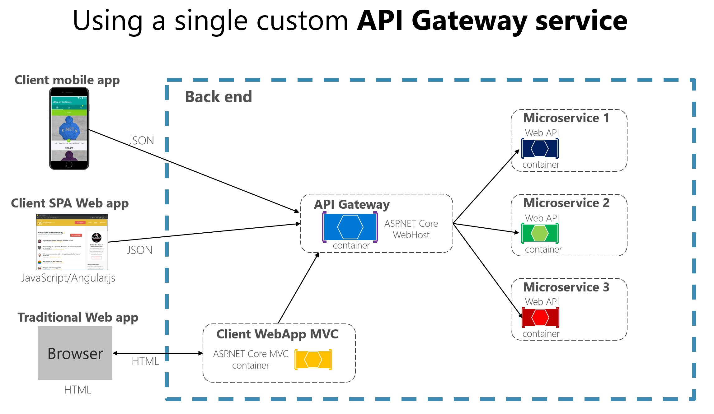

# API Gateway



## 1 ) 주요 기능
- 인증 및 권한 부여
- 서비스 검색 및 통합
- 응답 캐싱
- 정책, 회로 차단기 및 Qos 다시 시도
- 속도 제한
- 부하 분산
- 로깅, 추적, 상관 관계
- 헤더, 쿼리 문자열 및 청구 변환
- IP 허용 목록으로 접근 제어

## 2 ) Spring Cloud Gateway
- **비동기 처리** 지원
```properties
ℹ️ Zuul Project는 Deprecated되어 더이상 사용이 불가능
   - Spring에서도 Spring Cloud Gateway 사용을 권장👍
```

### 2 - 1 ) 설정 - application.yml 사용

#### dependencies
```properties
# ✅ Spring Cloud Gateway는 비동기, 논블로킹 방식으로 동작하는 API Gateway를 제공
#    - 이는 Netty 기반의 비동기 웹 서버를 사용하여 높은 성능과 확장성을 제공함
```
- 😅 살질... 
  - `gateway-mvc`를 사용해서 적용하면 gateway-route가 정상 작동하지 않음 그냥 `gateway`를 사용해야함
  - 이유
    - spring-cloud-starter-gateway는 **Reactive 환경(WebFlux)을 기본**으로 하며, 대부분의 기능은 이 환경에서만 완전하게 동작
      - 특별한 이유가 없는 한 **Reactive 기반**의 Spring Cloud Gateway를 **사용하는 것이 권장**
    - `spring-cloud-starter-gateway-mvc`는 WebFlux 기반의 Spring Cloud Gateway의 설정 방식을 지원하지 않음
      - **application.yml에 작성한 설정이 무시됨**
      - Spring MVC의 @RestController와 @RequestMapping을 사용하여 **라우팅을 구성해야 함**
        - 대상 서비스로 **요청을 포워딩하는 방식**
    - spring-cloud-starter-gateway는 비동기, 논블로킹 방식의 고성능 API Gateway를 제공
```groovy
dependencies {
    // ❌ implementation 'org.springframework.cloud:spring-cloud-starter-gateway-mvc'
    implementation 'org.springframework.cloud:spring-cloud-starter-gateway'
    implementation 'org.springframework.cloud:spring-cloud-starter-netflix-eureka-client'
}
```


#### application.yml
- 핵심 설정은 `cloud` 부분 설정
- id : 대상 route id 부여
  - route 대상 service name 과 달라도 **문제가 없음**  
- uri :  요청을 넘길 service uri
  - 연결에 필요한 **URI**를 통해 매칭 **URL ❌**
- predicates : gateway가 전달 route 할 지정 path
- filters : gateway에서 추가 처리 할 필터 내용 
```yaml
server:
  port: 8000

spring:
  application:
    name: gateway-service
  cloud:
    gateway:
      routes:
        - id: first-service
          uri: http://localhost:8081
          predicates:
            - Path=/first-service/**
          filters:
            - AddRequestHeader=first-request, first-request-header-using-yml-file
            - AddResponseHeader=first-response, first-response-header-using-yml-file
        - id: second-service
          uri: http://localhost:8082
          predicates:
            - Path=/second-service/**
          filters:
            - AddRequestHeader=second-request, second-request-header-using-yml-file
            - AddResponseHeader=second-response, second-response-header-using-yml-file
eureka:
  client:
    register-with-eureka: false
    fetch-registry: false
  service-url:
    defaultZone: http://localhost:8761/eureka/
```

### 2 - 1 ) 설정 - @Configuration 사용
```properties
# ✅ dependencies 설정은 동일
#    - 기존의 설정은 동일하나 application 설정 부분을 Java로 변경
```
#### application.yml
- port 및 eureka 설정 부분 skip 
```yaml
spring:
#  cloud:
#    gateway:
#      routes:
#        - id: first-service
#          uri: http://localhost:8081
#          predicates:
#            - Path=/first-service/**
#        - id: second-service
#          uri: http://localhost:8082
#          predicates:
#            - Path=/second-service/**
```
#### Config class
- Builder Pattern을 사용해서 등록
- path    : Gateway에 들어오는 요청 중 어떠한 path를 route 할지 지정
- filters : 원하는 filter 등록
- uri     : 요청을 넘길  service uri 등록 
```java
@Configuration
public class FilterConfig {
    @Bean
    public RouteLocator gatewayRoutes(RouteLocatorBuilder routeLocatorBuilder){
        return routeLocatorBuilder.routes()
                .route( r
                            // gateway에 해당 path 요청이 들어올 경우
                            -> r.path("/first-service/**")
                            // 필터 사용
                            .filters( f -> f.addRequestHeader("first-request", "first-request-header")
                                            .addResponseHeader("first-response", "first-response-header"))
                            // 해당 uri로 이동
                            .uri("http://localhost:8081"))
                .route( r -> r.path("/second-service/**")
                        .filters( f -> f.addRequestHeader("second-request", "second-request-header")
                                .addResponseHeader("second-response", "second-response-header"))
                        .uri("http://localhost:8082"))
                .build();
    }
}
```

## 3 ) Gateway CustomFilter
- `AbstractGatewayFilterFactory`를 상속하여 진행함
  - 추상 클래스이므로 `GatewayFilter apply`**구현을 강제함**
- 람다식으로 구성되며 `(exchange, chain)`는 **핵심 컴포넌트**이다.
  - exchange (ServerWebExchange)
    - 타입: ServerWebExchange
    - 의미: 현재 HTTP **요청과 응답에 대한 모든 정보 및 세션 정보**를 담고 있는 객체 
    - 요청/응답 수정: 요청 헤더, 응답 헤더 등을 **수정할 수 있음**
  - chain (GatewayFilterChain)
    - 타입: GatewayFilterChain
    - 의미: **현재 필터 체인을 나타내는 객체**입니다.
      - 필터 체인은 여러 필터가 순차적으로 실행되는 구조를 의미함
    - 다음 필터 호출: chain.filter(exchange)를 호출하여 **다음 필터로 요청을 전달**
    - 필터 체인 종료: chain.filter(exchange)를 호출하지 않으면 **필터 체인이 종료**
- 체인형식을 **return 전**에는 PreFilter 로직 작성할 수 있고 **return 할때**는 PostFilter 로직을 작성 할 수 있다.
  - return 시 비동기 통신을 하기에 **Mono or Flux**를 사용해 반환

### CustomFilter Class
```java
@Log4j2
@Component
public class CustomFilter extends AbstractGatewayFilterFactory{
    @Override
    public GatewayFilter apply(Object config) {
        return (exchange, chain) -> {
            // PreFilter Business Logic 적용 가능
            ServerHttpRequest serverHttpRequest   = exchange.getRequest();
            ServerHttpResponse serverHttpResponse = exchange.getResponse();
            log.info("Pre Filter - Request Id is ? ::: {}", serverHttpRequest.getId());

            return chain.filter(exchange).then(Mono.fromRunnable(()->{
                // PostFilter Business Logic 적용 가능
                log.info("Post Filter - Http Status ? :: {}", serverHttpResponse.getStatusCode());
            }));
        } ;
    }
}
```

### Application.yml
- 이전 설정에서 **filters** 부분 내 Custom Class Name만 추가 됨 
```yaml
spring:
  cloud:
    gateway:
      routes:
        - id: first-service
          uri: http://localhost:8081
          predicates:
            - Path=/first-service/**
          filters:
            - AddRequestHeader=first-request, first-request-header-using-yml-file
            - AddResponseHeader=first-response, first-response-header-using-yml-file
            - CustomFilter
        - id: second-service
          uri: http://localhost:8082
          predicates:
            - Path=/second-service/**
          filters:
            - AddRequestHeader=second-request, second-request-header-using-yml-file
            - AddResponseHeader=second-response, second-response-header-using-yml-file
            - CustomFilter
```