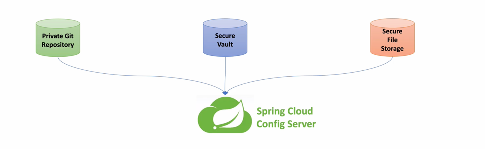

# Config Service



## 1 ) Spring Config Server란?
- MSA 구조에서 서버에 필요한 **설정 정보**를 **외부 시스템에서 관리** 할 수 있다.
  - 기존 application.yml -> Repository, 외부 접근 가능 파일 등을 사용
- **하나의 중앙화된 저장소에서 구성 요소를 관리** 할 수 있기에 **일관적인 설정이 가능**하다.
  - 휴먼 에러가 줄어 듬
- 기존 application.yml을 사용 할 경우 변경이 있을 때 서버 재배포가 필요 하지만 Config Server를 사용하면 설정 변경 시  재배포 불필요
- 각각의 설정 파일또한 운영 환경에 맞게 구성정보를 파이프라인을 통해 설정 가능
    - local, dev, pord 환경

## 2 ) 설정 파일 우선 순위
```properties
# application.yml -> 지정 이름(타겟 서버 이름).yml -> 지정 이름(타겟 서버 이름)-<profile>.yml 
```
- Config 서버 내 다양한 설정 파일(application.yml)을 저장해둔 후 해당 설정을 읽는 하위 Micro Service 내에서 지정한 설정을 가져오는 방식
  - Ex) user-service 서버에서 config server에 user-service 설정 파일을 요청 시 해당 `user-service.yml` 설정 값 반환
    - user-service 서버에서 profile을 prod로 요청 시 `user-service-prod.ygml` 설정 값 반환

## 3 ) 설정 방법
```properties
# ✅ 설정 파일을 읽어오는 방법은 3가지 예제를 사용 local-repository, remote-repository, file-read 
#   - Config Server의 Default Port : 8888 이다.
#   - http://localhost:8888/ecommerce/default 경로 요청 시 파일을 읽는 방법
#     - 지정 경로의 ecommerce.yml 이며 profile : default 
```

### 3 - 1 ) build.gradle
- 다른 dependencies는 불필요하며, **spring-cloud-config-server 만 추가**
```groovy
dependencies {
	implementation 'org.springframework.cloud:spring-cloud-config-server'
}
```

### 3 - 2 ) ServerApplication.java
- 가장 중요하다 `@EnableConfigServer`를 추가해줘야 ConfigServer로 **활성화 된다.**
  - 해당 부분을 누락하여 삽질함... 미지정 시 어떠한 방법으로도 설정 파일을 못 읽음
```java
@SpringBootApplication
// ⭐️ 해당 어노테이션을 추가하지 않으면 config 위치를 알맞게 지정해도 찾을 수 없음
@EnableConfigServer
public class ConfigServiceApplication {
	public static void main(String[] args) {
		SpringApplication.run(ConfigServiceApplication.class, args);
	}
}
```

### 3 - 3 ) application.yml
- spring -> cloud -> server 하위에 설정을 작성하여 진행한다.
####  3 - 3 - A )  git local 방식
- 해당 설정된 git의 파일 정보는 [링크](https://github.com/edel1212/Micro-Service-Architecture-Study/tree/main/git-local-repo)에서 확인 가능하다.
  - 해당 위치에 중앙에서 관리할 설정 yml파일이 존재함
```yaml
server:
  port: 8888 # Config Server Default Port Number

spring:
  application:
    name: config-service
  cloud:
    config:
      server:
        git:
          uri: file:///Users/yoo/Desktop/Project/config-repo
```

####  3 - 3 - B ) git remote 방식
- 기본 틀은 크게 다르지 않지만 https 프로토콜을 이용해 git clone의 주소를 넣어주면 된다.
```yaml
spring:
  cloud:
    config:
      server:
        git:
          uri: https://github.com/edel1212/config-repo.git
```