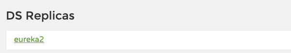

# Service Discovery

```properties
# ℹ️ Spring Cloud Netflix Eureka를 사용하여 구축함
```

## 1 ) Service Discovery란?
- 마이크로 서비스 위치 정보를 등록 및 검색 용도로 사용함
  - 쉬운 예시 ) 전화번호 책
  - Key, Value 형식으로 되어있음

## 2 ) Flow
-  1 . 사용자 요청
-  2 . Load Balancer를 통해 Spring Cloud 접근
-  3 . 사용자의 요청애 맞는 Service Discovery를 찾고 데이터 요청
-  4 . 사용자는 대상 서버에서 데이터를 전달 받음 


## 3 ) 설정 방법

### 3 - 1 ) build.gradle
- 다른 dependencies 추가 필요 없이 **eureka** 하나만 추가해주면 된다. 
```groovy
dependencies {
	implementation 'org.springframework.cloud:spring-cloud-starter-netflix-eureka-server'
}
```

### 3 - 2 ) application.yml
- Eureka Server 그 자체 이므로 위치 정보를 자기 자신에 등록할 필요가 없음 `register-with-eureka`, `fetch-registry`는 **false** 설정
  - default 설정 값 : `true` 
  - default port : `8761` 
```yaml
server:
    port: 8761

spring:
  application:
    name: discoveryservice

# ℹ️ eurek 설정 - Discovery Server 이기에 자기 자신을 등록할 필요가 없기에 false 처리 ( 기본 값 : true )
eureka:
  client:
      register-with-eureka: false
      fetch-registry: false
```

### 3 - 3 ) Application.java
- `@EnableEurekaServer`를 사용 **Eureka Server로써 기능 활성화**
```java
@EnableEurekaServer // ✅ 기능 활성화
@SpringBootApplication
public class EcoomerceApplication {
	public static void main(String[] args) {
		SpringApplication.run(EcoomerceApplication.class, args);
	}
}
```

## 4 ) Discovery Client(Eureka Client) 설정 방법
[참고](https://github.com/edel1212/Micro-Service-Architecture-Study/tree/main/eureka-client)

## 5 ) Discover Service 이중화

### 5 - 1 ) 설정
- Discover Service 이중화를 통해 하나의 Discover 서버가 죽더라도 대응이 가능 -> **가용성 증가**
- `serviceUrl.defaultZone`를 통해 하위 서버들은 이어져 있게 설정 필요
  - ex) `defaultZone: http://localhost:8761/eureka, http://localhost:8762/eureka, http://localhost:8763/eureka`
-  `instance.hostname`?
  - Eureka 서버에 등록되는 자신 정보 중 하나로, 클라이언트나 대시보드가 이 값을 통해 인스턴스를 식별할 수 있음
  - prefer-ip-address: true 추가 시 **hostname 대신 IP가 표시**됨

#### 5 - 1 - A ) application.yml [ 일반 사용 설정 ]
```yaml
server:
  port: 8761

spring:
  application:
    name: discoveryservice

# ℹ️ eurek 설정 - Discovery Server 이기에 자기 자신을 등록할 필요가 없기에 false 처리 ( 기본 값 : true )
eureka:
  client:
    register-with-eureka: false
    fetch-registry: false

---
# ✅ Docker를 사용한 테스트 진행
spring:
  config:
    activate:
      on-profile: eureka2

server:
  port: 8762

eureka:
  client:
    serviceUrl:
      defaultZone: http://localhost:8763/eureka
  instance:
    hostname: localhost

---
spring:
  config:
    activate:
      on-profile: eureka3

server:
  port: 8763

eureka:
  client:
    serviceUrl:
      defaultZone: http://localhost:8762/eureka
  instance:
    hostname: localhost
```

#### 5 - 1 - B ) application.yml [ Docker 사용 설정 ]

- `hostname`가 의미있게 적용되는 것을 확인 가능
```yaml
server:
  port: 8761

spring:
  application:
    name: discoveryservice

# ℹ️ eurek 설정 - Discovery Server 이기에 자기 자신을 등록할 필요가 없기에 false 처리 ( 기본 값 : true )
eureka:
  client:
    register-with-eureka: false
    fetch-registry: false

---
# ✅ Docker를 사용한 테스트 진행
spring:
  config:
    activate:
      on-profile: eureka2

server:
  port: 8762

eureka:
  client:
    serviceUrl:
      defaultZone: http://eureka2:8763/eureka
  instance:
    hostname: eureka2.local

---
spring:
  config:
    activate:
      on-profile: eureka3

server:
  port: 8763

eureka:
  client:
    serviceUrl:
      defaultZone: http://eureka3:8762/eureka
  instance:
    hostname: eureka3.local
```

### 5 - 2 ) Discovery Client 적용 
- 사용 가능한 Discovery Service들 등록
```yaml
server:
  port: 7876

spring:
  application:
    name: discover-client

eureka:
  client:
    register-with-eureka: true
    fetch-registry: true
    service-url:
      # ✅ 연결한 Discovery Service URI 지정
      defaultZone: http://localhost:8761/eureka, http://localhost:8762/eureka, http://localhost:8763/eureka

  # HeaderBeat 주기 주정
  instance:
    lease-renewal-interval-in-seconds: 5   # Heartbeat 주기 (기본값: 30초)
    lease-expiration-duration-in-seconds: 10 # Heartbeat 없을 때 제거까지 걸리는 시간 (기본값: 90초)
```

