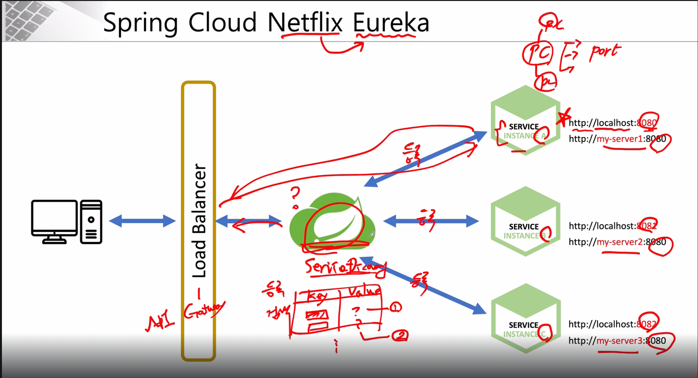

# Service Discovery

```properties
# ℹ️ Spring Cloud Netflix Eureka를 사용하여 구축함
```

## 1 ) Service Discovery
- 마이크로 서비스 위치 정보를 등록 및 검색 용도로 사용함
  - 쉬운 예시 : 전화번호 책
  - Key, Value 형식으로 되어있음

## 2 ) Flow
-  1 . 사용자 요청
-  2 . Load Balancer를 통해 Spring Cloud 접근
-  3 . 사용자의 요청애 맞는 Service Discovery를 찾고 데이터 요청
-  4 . 사용자는 대상 서버에서 데이터를 전달 받음 


## 3 ) Discovery Server(Eureka Server) 설정 방법

### 3 - 1 ) build.gradle
- 다른 dependencies 추가 필요 없이 **eureka** 하나만 추가해주면 된다. 
```groovy
dependencies {
	implementation 'org.springframework.cloud:spring-cloud-starter-netflix-eureka-server'
}
```

### 3 - 2 ) application.yml
- Eureka Server 그 자체이기에 자기 자신의 위치 정보를 자기자신에 등록할 필요가 없기에 `register-with-eureka`, `fetch-registry`는 **false**
  - 기본값 : true 
```yaml
server:
    port: 8761

spring:
  application:
    name: discoveryservice

# ℹ️ eurek 설정 - Discovery Server 이기에 자기 자신을 등록할 필요가 없기에 false 처리 ( 기본 값 : true )
eureka:
  client:
      register-with-eureka: false
      fetch-registry: false
```

### 3 - 3 ) Application.java
- `@EnableEurekaServer`를 사용해서 해당 Server는 **Eureka Server로 사용 지정**
```java
@EnableEurekaServer
@SpringBootApplication
public class EcoomerceApplication {
	public static void main(String[] args) {
		SpringApplication.run(EcoomerceApplication.class, args);
	}
}
```

## 4 ) Discovery Client(Eureka Client) 설정 방법
[참고](https://github.com/edel1212/Micro-Service-Architecture-Study/tree/main/eureka-client)
