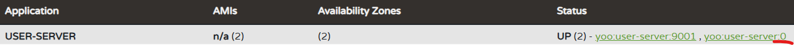

# Eureka Client
- Discovery Server( Eureka Server )에 등록 할 각각의 서버를 의미
## 1 ) 설정 방법

### 1 - 1 ) build.gradle
- 각각의 마이크로 서비스들은 RESTFul API로 통신하기에 `boot-starter-web`는 필수
```groovy
dependencies {
	implementation 'org.springframework.boot:spring-boot-starter-web'
	implementation 'org.springframework.cloud:spring-cloud-starter-netflix-eureka-client'
	annotationProcessor 'org.projectlombok:lombok'
}
```

### 1 - 2 ) application.yml
- application name은 Discovery Server 내에서 식별하는 이름으로 보여지기에 꼭 작성해 주자
- eureka 내 client 설정 필요
  - register-with-eureka :  현재 애플리케이션을 Eureka 서버에 등록 여부를 설정
  - fetch-registry : 다른 MSA Server의 정보를 받아욜지 여부 설정
  - defaultZone : EurekaServer 도메인 지정
- ✨ 추가 ) CLI를 통해 Port 동적 할당 방법
  - `./gradlew bootRun --args='--server.port=9003'`를 사용하면 `${SERVER_PORT}`를 사용하지 않고도 포트 지정 가능 
```yaml
server:
  port: ${SERVER_PORT}

spring:
  application:
    name: user-server

eureka:
  # Eureka와 관련된 설정을 정의합니다.
  client:
    # 현재 애플리케이션을 Eureka 서버에 등록할지 여부를 설정합니다.
    register-with-eureka: true
    # Eureka 서버에서 서비스 정보를 가져올지 여부를 설정합니다.
    fetch-registry: true
    # Eureka 서버의 URL을 설정합니다.
    service-url:
      # Eureka 서버의 기본 주소를 설정합니다.
      defaultZone: http://127.0.0.1:8761/eureka

  # HeaderBeat 주기 주정
  instance:
    lease-renewal-interval-in-seconds: 5   # Heartbeat 주기 (기본값: 30초)
    lease-expiration-duration-in-seconds: 10 # Heartbeat 없을 때 제거까지 걸리는 시간 (기본값: 90초)
```
### 1 - 3 ) application.java
- SpringBoot 2.x 버전에서는 명시적으로`@EurekaClient` 지정이 필요했으나 3.x 버전부터는 불필요
```java
@SpringBootApplication
public class UserServerApplication {
	public static void main(String[] args) {
		SpringApplication.run(UserServerApplication.class, args);
	}
}
```

## 2 ) Random Port 적용 방법
- Auto Scaling이 필요할 경우 하나하나 Port 번호를 지정해 줄수 없기에 사용한다.

### 2 - 1 ) 설정 방법
#### application.yml
- port를 2번으로 지정하면 랜덤하게 포트번호가 지정되어 서버가 실행된다.
```yaml
server:
  port: 0
```

### 2 - 2 ) 문제 사항
- 2 - 1 방식으로 여러개의 서버를 기동해도 **Discovery Server(Eureka Server)**에는 하나의 서버만 기동되어 보인다.
  - EurekaServer 자체가 서버 기동 시 입력된 **env 파일 기반으로 등록되기 때문**이다
    - 

### 2 - 3 ) 해결 방법
- **instance-id** 설정을 통해 호스트명:UUID를 통해 인스턴스 아이디를 사용 할 수있다.
  - 실제로 사용하는 포트는 0으로 보여도 마우스를 올리면 기존 port가 연결 되어있기에 **아이디만** UUID를 **통해 중복을 제거**한 것

#### application.yml
```yaml
eureka:
  # Eureka instance 관련된 설정을 정의합니다.
  instance: 
    # instance-id 설정
    instance-id: ${spring.cloud.client.hostname}:${spring.application.instance_id:${random.value}}
```