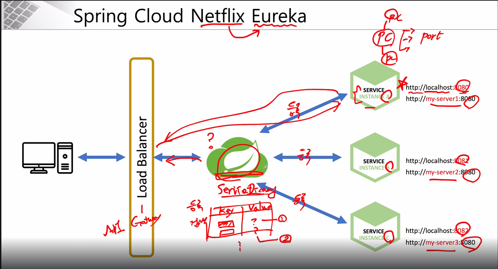

# Service Discovery

```properties
# ℹ️ Spring Cloud Netflix Eureka를 사용하여 구축함
```

## Service Discovery
- 마이크로 서비스 위치 정보를 등록 및 검색 용도로 사용함
  - 쉬운 예시 : 전화번호 책
  - Key, Value 형식으로 되어있음

## Flow
-  1 . 사용자 요청
-  2 . Load Balancer를 통해 Spring Cloud 접근
-  3 . 사용자의 요청애 맞는 Service Discovery를 찾고 데이터 요청
-  4 . 사용자는 대상 서버에서 데이터를 전달 받음 

