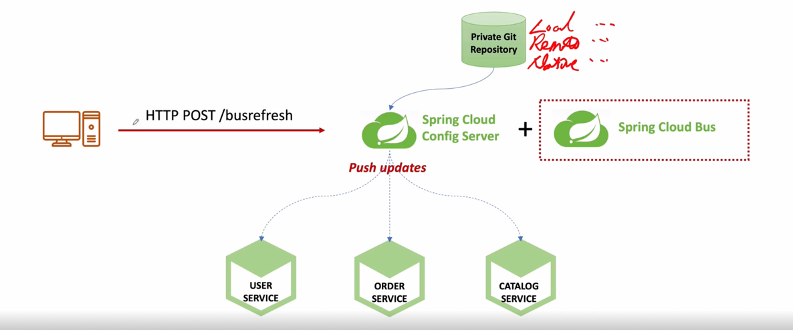

# Spring Cloud Bus


```yaml
# ✅ Spring Config Server 와 Actuator 사용만으로 부족한 부분을 Message-Queuing을 통해 해결
#    - Spring Config Server + Spring Cloud Bus를 합쳐 사용함으로 써 좀 더 MicoServie에 맞는 구조로 만듬
#    - MessageQueuing에는 RabbitMQ를 사용
```

## 1 ) AMQP( Advanced Message Queuing Protocol )
- 메시지 지향 미들웨어를 위한 개방형 표준 응용계층 프로토콜
- 메세지 지향, 큐잉, 라우팅 ( P2P, Publisher-Subscriber ), 신뢰성, 보안
- RabbitMQ에서 사용
  - 메세지 브로커
  - 메세지 전달 보장, 시스템 간 메세지 전달
  - 브로커, 소비자 중심

## 2 ) 흐름

- 1 . 개발자가 지정한 HTTP Protocol을 통해 **아무 MicroService 또는 ConfigService에 요청**
- 2 . Spring Cloud Bus가 변경 요청을 파악하여 ConfigServive와 **연결된 모든 서비스를 refresh** 시킴
  - 상태 및 구성에 대한 변경 사항을 **연결된 노드에게 Broadcast 전달**