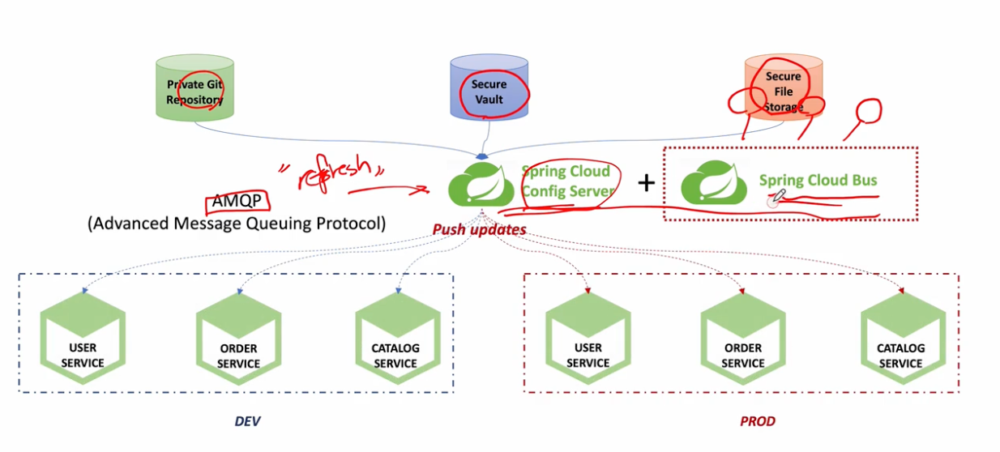
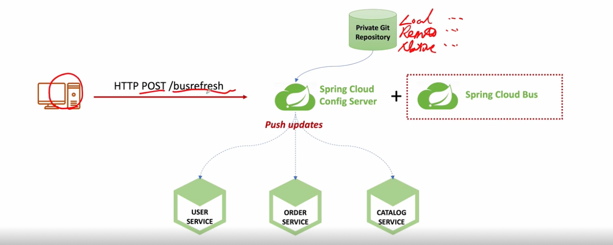

# Spring Cloud Bus



```yaml
# ✅ Spring Config Server 와 Actuator 사용만으로 부족한 부분을 Message-Queuing을 통해 해결
#    - Spring Config Server + Spring Cloud Bus를 합쳐 사용함으로 써 좀 더 MicoServie에 맞는 구조로 만듬
#    - MessageQueuing에는 RabbitMQ를 사용
```

## 1 ) AMQP( Advanced Message Queuing Protocol ) 란?
- 메시지 지향 미들웨어를 위한 개방형 표준 응용계층 프로토콜
- 메세지 지향, 큐잉, 라우팅 ( P2P, Publisher-Subscriber ), 신뢰성, 보안
- RabbitMQ에서 사용
  - 메세지 브로커
  - 메세지 전달 보장, 시스템 간 메세지 전달
  - 브로커, 소비자 중심

## 2 ) 전체 흐름



- 1 . 개발자가 지정한 HTTP Protocol을 통해 **아무 MicroService 또는 ConfigService에 요청**
- 2 . Spring Cloud Bus가 변경 요청을 파악하여 ConfigServive와 **연결된 모든 서비스를 refresh** 시킴
  - 상태 및 구성에 대한 변경 사항을 **연결된 노드에게 Broadcast 전달**

## 3 ) RabbitMQ 
- Docker-Compose를 사용
```yaml
services:
  rabbitmq:
    image: rabbitmq:3.12-management  # 관리 UI 포함된 버전
    container_name: rabbitmq
    ports:
      - "5672:5672"  # AMQP 프로토콜 포트
      - "15672:15672"  # 웹 UI 포트
    environment:
      RABBITMQ_DEFAULT_USER: admin
      RABBITMQ_DEFAULT_PASS: admin
    volumes:
      - ./data:/var/lib/rabbitmq  # 현재 디렉토리의 `data` 폴더를 마운트
```

## 4 ) 설정 및 사용 방법
```yaml
# ✅ 당연하지만 Config Server에서 yml 설정을 읽어오지 않을 경우 해당 설정은 불필요함
#    ㄴ> 설정이 필요한 모든 하위 서버에는 해당 설정이 필요함
```
- 필수 조건
  - RabbitMQ 서버가 기동 되어야한다.
  - dependencies 3개가 필수 적으로 필요하다.
    - spring-cloud-starter-bus-amqp
      - RabbitMQ에서 제공하는 amqp 프로토콜을 사용해서 message bus를 하기 위함
    - spring-bboot-starter-actuator
      - `/actuator/busrefresh` 를 사용하여 연결된 모든 Micro Service를 업데이트 하기 위함
    - spring-cloud-starter, spring-cloud-starter-config 
      - Config Client 사용을 위함

### 4 - 1 ) build.gradle
- 삽질한 부분은 spring initializr에서 제공하는 `spring-cloud-bus`와 `starter-bus-amqp`와 다르다는 점이다
  - `spring-cloud-bus`의 경우는 기본적인 Spring Cloud Bus 기능만 포함 RabbitMQ, Kafka 등의 전송 방식(X)  **별도 설정 필요**
```groovy
dependencies {
	// Spring Cloud Bus - AMQP(RabbitMQ)
	implementation group: 'org.springframework.cloud', name: 'spring-cloud-starter-bus-amqp', version: '4.2.0'

	// Actuator
	implementation 'org.springframework.boot:spring-boot-starter-actuator'

	// Config Client
	implementation 'org.springframework.cloud:spring-cloud-starter'
	implementation 'org.springframework.cloud:spring-cloud-starter-config'
}
```

### 4 - 2 ) application.yml
- Actuator의 busrefresh를 무조건 모든 하위 서비스가 **할당 해줄 필요는 없다**
  - rabbitmq로 연동 되어있다면 해당 **end-point를 활성화 하지 않아도 설정 값이 update 된다.**
    - 다만 **특정 어떠한 한개 이상의 Service**에서는 busrefresh를 할 수 있게 **설정은 필요**함
```yaml
spring:
  application:
    name: gateway-service

  # RabbitMQ Setting
  rabbitmq:
    host: 127.0.0.1
    port: 5672
    username: admin
    password: admin

  # Config Server Setting
  config:
    import: optional:configserver:http://localhost:8888
  profiles:
    active: dev
  cloud:
    # Config Server Setting - target yml 파일 지정
    config:
      name: ecommerce  # `ecommerce.yml`을 읽도록 설정

# Actuator 설정
management:
  endpoints:
    web:
      exposure:
        # /actuator/** 로 사용할 기능 설정
        include: busrefresh
```

## 5 ) spring cloud bus 사용 흐름
```yaml
# ✅ Spring Cloud Bus를 사용하지 않을 경우 Config Server의 정보가 업데이트 되어도 하위 서버에 정보가 적용되기 위해서는
#    "서버 재기동" 혹은 "/actuator/refresh"를 통해서 설정 정보를 갱신해서 받오게 했어야 했다.
```
- 1 . RabbitMQ 서버 기동 및 Config Server의 설정 값을 사용하는 모든 하위 서버는 해당 RabbitMQ에 연동 시킴
  - `spring cloud bus-amqp`사용
- 2 . Config Server에서 정보가 갱신 되었을 경우 지정된 actuator를 허용한 서버에 `/actuator/busrefresh`를 요청
  - ✨ POST로 요청을 보내야한다 .. 삽질함 ..
- 3 . RabbitMQ에 연동된 하위 서버가 새로 적용된 Config Server 값으로 갱신함.