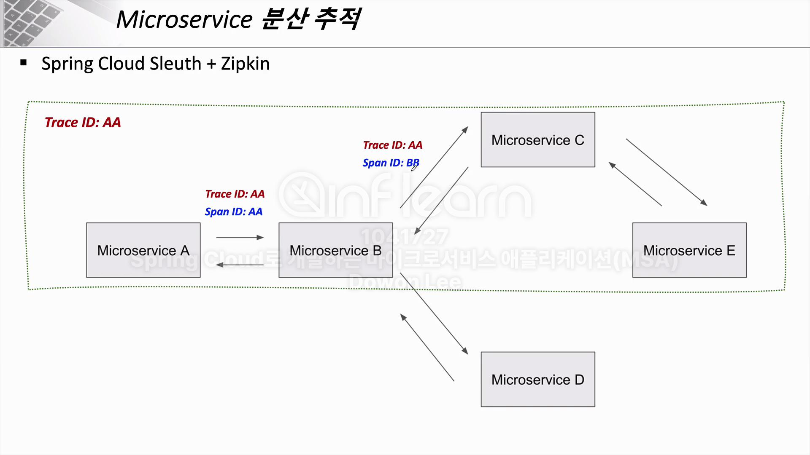
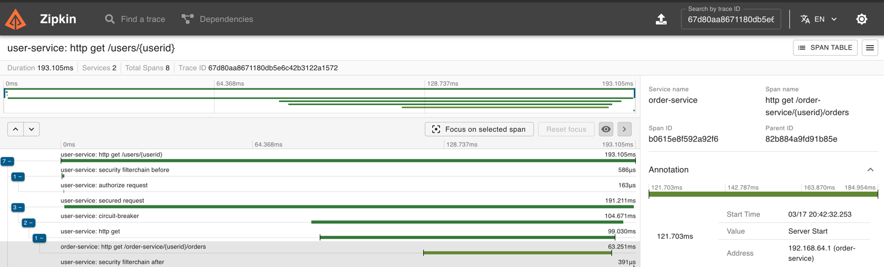
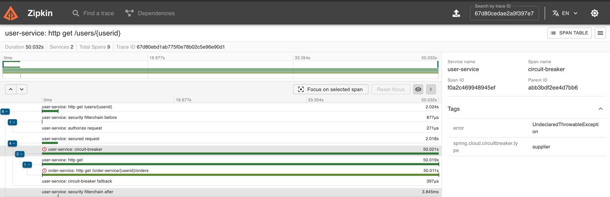

# Zipkin
```yaml
# ✅ 분산 트레이싱 시스템으로 마이크로서비스 아키텍처(MSA)에서 요청(request)이 여러 서비스를 거칠 때, 각 서비스에서 요청의 흐름을 추적하고 분석할 수 있도록 함
#    - TraceId 와 SpanId을 사용하여 추적 ( TraceId는 유일 SpanId는 각각의 Transaction 마다 생성된다. )
```

- Zipkin의 주요 기능
  - 분산 트랜잭션 추적: 요청이 여러 서비스를 거칠 때, **어디서 얼마나 시간이 걸렸는지 추적**
  - 지연(latency) 분석: 특정 서비스 또는 API 호출에서 발생하는 **응답 지연 파악**
  - 오류 감지: 특정 서비스에서 발생한 **문제를 빠르게 찾을 수 있음**
  - B3 Propagation 지원: 서비스 간의 **요청 흐름을 추적**
    - **traceId, spanId 등의 컨텍스트 정보를 전파**

## 1 ) Zipkin Server
- Docker Compose를 이용해 구동
- 기본적으로 Memory를 이용해 정보를 저장하나 필요에 따라 Database를 연동해서 저장 가능
  - Database를 연동할 경우 Zipkin이라는 스키마가 존재해야 함
```yaml
services:
  zipkin:
    image: openzipkin/zipkin:latest
    container_name: zipkin
    ports:
      - "9411:9411"
    environment:
      # Storage 저장 방식
      - STORAGE_TYPE=mem
    restart: always
```

## 2 ) Spring-Boot using Zipkin
```yaml
# ✅ 요청의 흐름 파악 대상의 Service에는 모두 적용해줘야한다.  
```

### 2 - 1 ) build.gradle
- Spring Boot3에서 **spring-cloud-starter-sleuth가 제거**되었고, 대신 **Micrometer Tracing을 사용**해야 함
  - Micrometer Tracing을 이용하여 Zipkin과 연동하려면 **Brave를 사용한 설정이 필요**
- Feign을 사용해 연계를 진행할 경우 해당 Trace를 추적하기 위해 `feign-micrometer`가 필수 적으로 필요함
  - ☠️ 삽질 : 서버 기동 및 Zipkin Dashboard 내 에러는 없으나 TraceId가 이어지지 않음
    
```groovy
dependencies {
	// Zipkin
	implementation 'org.springframework.boot:spring-boot-starter-actuator'
	implementation 'io.micrometer:micrometer-tracing-bridge-brave'
	implementation 'io.zipkin.reporter2:zipkin-reporter-brave'
	implementation 'io.github.openfeign:feign-micrometer' // ✅ feign 사용 시 zipkin 과 traceId 공유를 위해 필요
}
```

### 2 - 2 ) application.yml
- `tracing.sampling.probability` : **샘플링 비율을 설정** 1.0 일 경우 100% / 0.7 일 경우 70%
- `tracing.propagation` 설정
  - `tracing.propagation.consume`→ 외부에서 들어오는 트레이스 정보를 어떤 형식으로 받을지 결정
  - `tracing.propagation.produce` → 외부로 나가는 트레이스 정보를 어떤 형식으로 보낼지 결정 

```yaml
management:
  # Zipkin 설정
  tracing:
    sampling:
      probability: 1.0 # 샘플링할 비율 - 100% 샘플링 (모든 요청을 추적)
    propagation:
      consume: B3
      produce: B3_MULTI
  zipkin:
    tracing:
      endpoint: "http://localhost:9411/api/v2/spans" # ⭐️ Zipkin 서버 주소
```

## 3 ) 흐름
- `User-Service`와 `Order-Service`가 있는 상태에서 `User-Service` --(Feign)--> `Order-Service` 데이터를 가져 옴
  - User-Service에는 CircuitBreak-Resilience4j가 적용되어 있음 [참고](https://github.com/edel1212/Micro-Service-Architecture-Study/tree/main/circuitBreaker)

### 3 - 1 ) 연계 성공

- 1 . Zipkin server 구동 ( localhost:지정포트에서 DashBoard 제공 )
- 2 . User-Server 내 회원 정보 조회 시 Order-Service를 Feign을 사용해서 연계 
  - User-Service Log : `INFO 44979 --- [user-service] [o-auto-1-exec-2] [67d80aa8671180db5e6c42b3122a1572-95964a71262d2f34] c.y.u.service.UserServiceImp`
    -  Trace ID 가 67d80aa8671180db5e6c42b3122a1572 인것을 확인가능
  - Order-Service Log : `INFO 44984 --- [order-service] [o-auto-1-exec-2] [67d80aa8671180db5e6c42b3122a1572-b0615e8f592a92f6] c.y.o.controller.OrderController`
    -  Trace ID 67d80aa8671180db5e6c42b3122a1572 로 같은 것을 볼 수 있음

### 3 - 2 ) 연계 실패

- 1 . Zipkin server 구동 ( localhost:지정포트에서 DashBoard 제공 )
- 2 . User-Server 내 회원 정보 조회 시 Order-Service를 Feign을 사용해서 연계
  - CircuitBreakerConfig 설정 시 **요청이 2초 이상 걸리면 자동으로 타임아웃 발생** 설정
- 3 . Order-Service 내 요청을 받을 시 랜덤하게 5초 지연하게 끔 설정 하여 애러 발생
  - CircuitBreaker 정상 작동 확인하기 위함


## 3 ) Zipkin Server - DB 사용
- 중요 포인트는 볼륨 설정을 통해 사용에 필요한 table을 생성해 주는 것이다.
  - `- ./initdb.d:/docker-entrypoint-initdb.d`

### 3 - 1 ) initdb.d.sql
> git hub을 통해 확인

### 3 - 2 ) docker compose
```yaml
services:
  zipkin:
    image: openzipkin/zipkin:latest
    container_name: zipkin
    ports:
      - "9411:9411"
    environment:
      # ✅ DB 사용을 위함
      #- STORAGE_TYPE=mem
      - STORAGE_TYPE=mysql
      - MYSQL_DB=zipkin
      - MYSQL_USER=zipkin
      - MYSQL_PASS=zipkin
      - MYSQL_HOST=mysql
      - MYSQL_TCP_PORT=3307  # ✅ 포트 지정 추가
    depends_on:
      - mysql
    networks:
      - micro-service-network

  mysql:
    image: mysql
    command: --port=3307  # ✅ 내부 포트를 3307로 지정
    volumes:
      - ./initdb.d:/docker-entrypoint-initdb.d
    environment:
      MYSQL_DATABASE: zipkin
      MYSQL_USER: zipkin
      MYSQL_PASSWORD: zipkin
      MYSQL_ROOT_PASSWORD: root
    ports:
      - "3307:3307"

networks:
  micro-service-network:
    #driver: bridge
    external: true  # 이미 생성된 네트워크 사용	
```